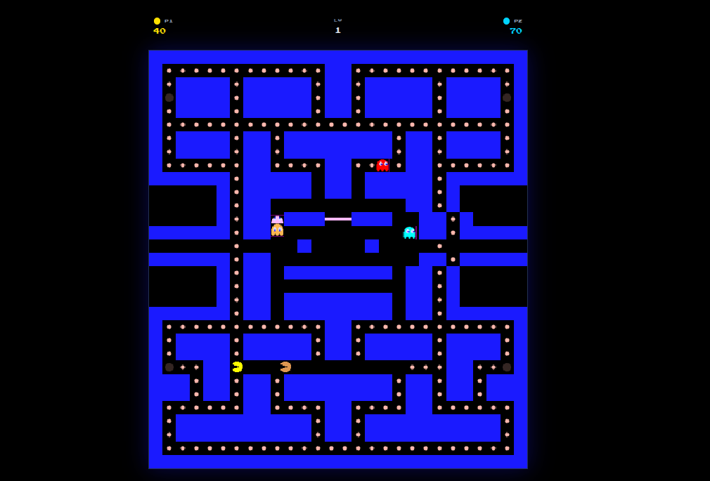
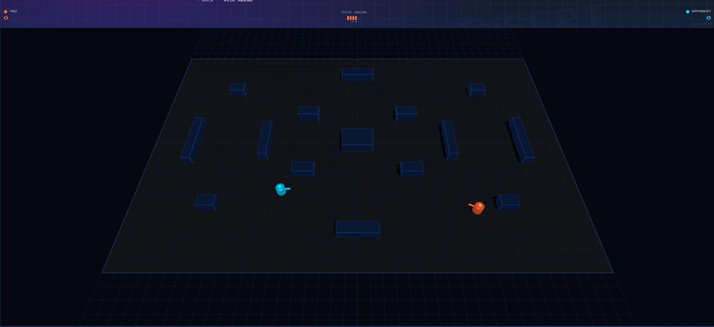

# Cosmos Arcade

Browser-based PvP arcade games with ATOM bets on Cosmos Hub. No installs, no downloads. Open the browser, connect Keplr, and play.

Think flash games from the early internet, except the stakes are real.

## What it is

Cosmos Arcade is a lightweight gaming platform where you pick a game, put up some ATOM, and play a friend (or a stranger) for the pot. Funds are locked in a CosmWasm escrow contract on-chain. The winner is determined in the game and the contract pays out immediately after.

Casual mode is free. Competitive mode locks tokens. That's the whole idea.

## Games

### Pac-Man PvP
Two players, same maze. Most dots eaten in 90 seconds wins.



### Void Arena
3D arena shooter in the browser. First to 5 kills wins. WASD + mouse aim.



### Retro FPS *(coming soon)*
Classic raycasting deathmatch. First to 10 frags.

### On the roadmap
- Snake Duel
- Tetris PvP
- Platform Racing
- Chess

Same idea every time: two players, a wager, one winner.

## How it works

1. Connect Keplr
2. Pick a game
3. Choose casual (free) or competitive (lock ATOM)
4. Share the invite link or wait for a public match
5. Both players ready up, countdown, game starts
6. Winner reported on-chain, payout

Everything runs in the browser. The server handles matchmaking and relays game state between players in real time. No game logic runs server-side.

## Stack

| Layer | Tech |
|---|---|
| Frontend | Vite + React + TypeScript + Tailwind |
| Games | Canvas / Three.js (no game engine) |
| Server | Node.js + WebSockets + Redis |
| Chain | Cosmos Hub - CosmWasm escrow contract |
| Wallet | Keplr |

## Running locally

```bash
# Prerequisites: Node 20+, Redis, Keplr extension

# Frontend
cd frontend && npm install && npm run dev

# Server
cd server && npm install && npm run dev
```

Or with Docker:

```bash
cp .env.example .env
docker-compose up
```

## Adding a game

Drop a new entry in `frontend/src/lib/games.ts` with a slug, title, description, thumbnail, and a lazy-loaded component. The matchmaking, escrow, and settlement system picks it up automatically.

See `docs/plug_game.md` for the full spec.

## Why

Crypto needs more things people actually want to use. Arcade games are simple, fast, and social. ATOM betting makes every match mean something. No governance, no yield farming, no liquidity pools. Just two people playing a game for money, settled in seconds on-chain.

Built for the Cosmos Hub hackathon.
